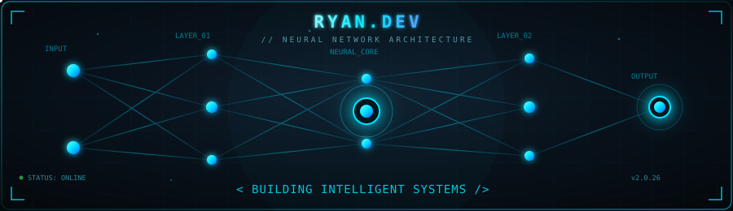
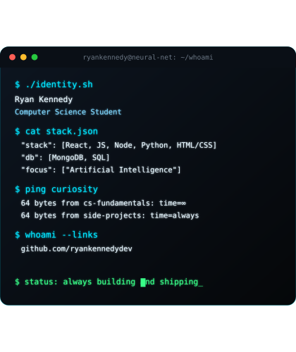

 

### `ryan@neural-net ~ $ ./whoami.sh`

<table>
<tr>
<td width="45%">

</td>
<td width="55%">

</td>
</tr>
</table>

---

### `ryan@neural-net ~ $ cat about.md`

- 🎓 Computer Science student
- ☁️ Always studying
- 🧠 Focused on **Artificial Intelligence** and distributed systems
- 🌱 Always training on something new

---

### `ryan@neural-net ~ $ ls ./stack`

---

### `ryan@neural-net ~ $ top --sort=stats`

 

---

### `ryan@neural-net ~ $ curl connect --me`

$ process complete — connection established_

